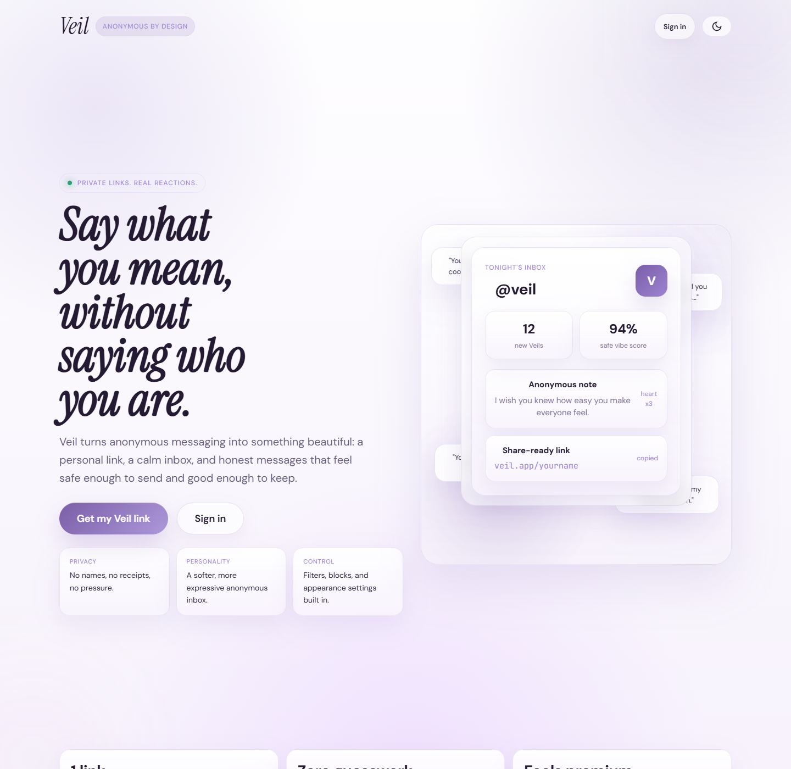

# Veil

Veil is a premium, privacy-first anonymous messaging concept built as a single-file frontend prototype.

It focuses on:

- Anonymous inboxes with a polished, Gen Z-friendly visual style
- Consent-first interaction patterns
- A landing page, sign in / sign up flow, inbox, chats, requests, studio, and settings
- Dark, atmospheric UI with a soft premium feel

## Preview

## How to run

Open `veil-app.html` directly in a desktop browser such as Chrome or Edge.

## Notes

- This is a frontend demo, so the auth and email code flow are simulated in the UI.
- The project is intentionally kept in one HTML file for easy review and sharing.
